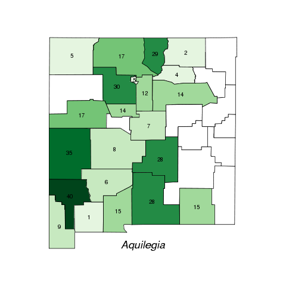
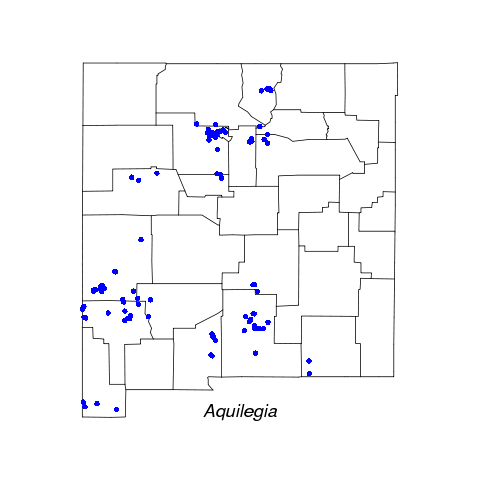

# Introduction

This guide describes how to download and plot collection data in [`R`](http://cran.r-project.org) from the New Mexico Biodiversity Collections Consortium [NMBCC](http://nmbiodiversity.org/) using the Global Biodiversity Information Facility [GBIF](http://data.gbif.org).  You will need to install a few R packages including maps, dismo, RColorBrewer, and XML.  Next, download the `nmbcc.R` file above to your working directory and `source` the file to install the additional functions.

        library(maps); library(dismo); library(RColorBrewer); library(XML)
	source("nmbcc.R")
       
The main function is `nmbcc`, which downloads the GBIF records from NMBCC and outputs a new class object `gbif` with three basic methods: print, plot and points.
Basically, the `nmbcc` script uses a hack to paste extra url strings such as the dataproviderkey to the species option from `gbif()` in the `dismo` package and then reformats the output.  The default is to only return the number of collections available, in this case the number of columbines in the genus Aquilegia. Use the download option to retrieve the data.

	nmbcc("Aquilegia")
	[1] "Searching GBIF for Aquilegia"
	[1] "359 occurrences available. Set download=TRUE to download"
	aq <- nmbcc("Aquilegia", download = TRUE)

The `print` method displays the first few rows of the table (last 6 columns not shown). 

	aq
	  A GBIF table with 359 rows and 12 columns

	                 species                  collector  collected country      state            county
	1     Aquilegia caerulea    H. Higgins and Campbell 1979-07-18      US New Mexico            Colfax
	2     Aquilegia caerulea T.S. Foxx and G.D. Tierney 1979-07-23      US New Mexico        Los Alamos
	3     Aquilegia caerulea               A.J. Dickson 1905-06-22      US New Mexico McKinley/San Juan
	4     Aquilegia caerulea              P.C. Standley 1908-07-01      US New Mexico              Mora
	5     Aquilegia caerulea           Allred, Kelly W. 1997-07-30      US New Mexico              Mora
	...                  ...                        ...        ...     ...        ...               ...
	359 Aquilegia triternata                E.J. Bedker 1962-08-05      US New Mexico          Torrance

The `plot` method displays a county map. 

	plot(aq)
	[1] "Warning: 18 collections not mapped"

The `points` method plots coordinates.

	> points(aq)
	[1] "Warning: 233 collections not mapped"

Test 1

Test2

